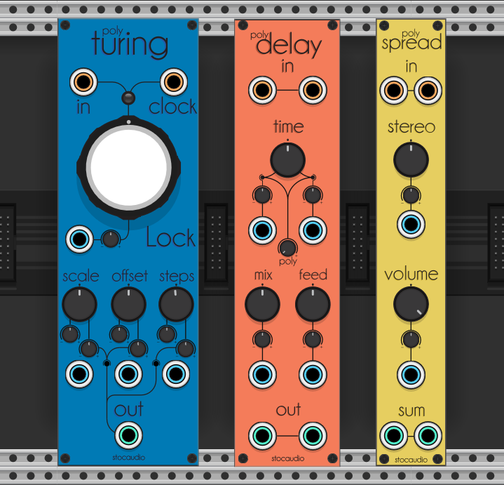

# stocaudio-modules

Modules for [VCV Rack](https://github.com/VCVRack/Rack), open-source Eurorack-style virtual modular synthesizer.

## Plugins


### Polyturing

This module is a revisited software version of the [Random Looping Sequencer](https://musicthing.co.uk/pages/turing.html) by Tom Whitwell in a polyphonic fashion.
 - Channel number is set by the In or Clock inputs
 - You can self-modulate Offset and Scale parameters using attenuverters

### Polydelay

This is a polyphonic fork of [Fundamental Delay](https://github.com/VCVRack/Fundamental) by VCV. The code is pretty much the same with a few adjusment.

- Channel number is set by the Left and Right inputs. Left acts as mono to stereo if it's the only one connected
- Time sets the delay time for both channels, each CV with attenuverter works for each channel
- Poly sets an offset of the delay time for each polyphony channel on both Left and Right

### Polyspread

This is a polyphonic summer and stereo spreader.

- Channel number is set by the Left and Right inputs. Left acts as mono to stereo if it's the only one connected
- Stereo spreads each polyphony channel from left to right and viceversa for positive and negative values
- Volume attenuates signals from 0.f to 1.f, can act as a VCA

## Building

Build deps using:

```bash
make dep
```

Build plugins using:

```bash
make
```

## License
[GPLv3](https://opensource.org/licenses/gpl-3.0)
