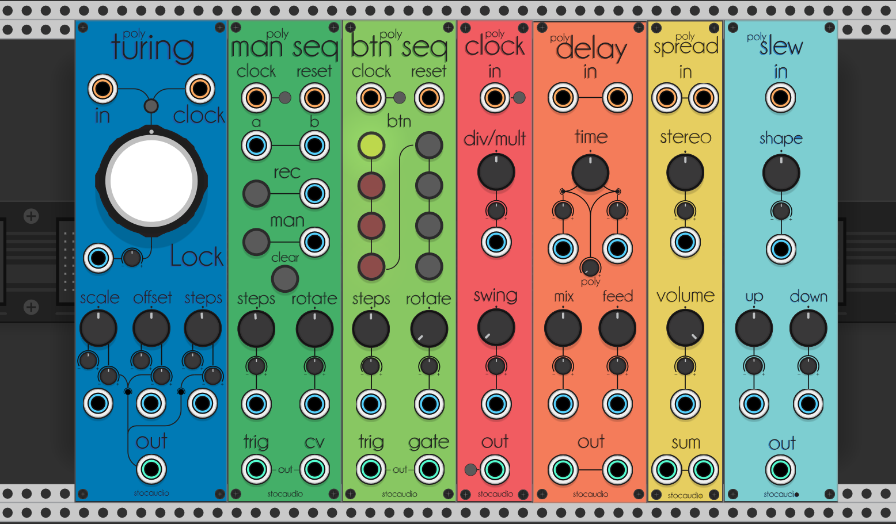

# stocaudio-modules

Modules for [VCV Rack](https://github.com/VCVRack/Rack), open-source Eurorack-style virtual modular synthesizer.

## Plugins


### Polyturing

This module is a revisited software version of the [Random Looping Sequencer](https://musicthing.co.uk/pages/turing.html) by Tom Whitwell in a polyphonic fashion.
 - Channel number is set by the In or Clock inputs
 - You can self-modulate Offset and Scale parameters using attenuverters

### Man Seq

This is a polyphonic human driven sequencer and voltage switch.

- Channel number is set by the Clock input
 - For each Clock recieved it steps through the sequence, length is set with the Steps parameter
- Rotate sets the new first step when Reset is triggered
- Record button activates and deactivates recording
- Man button sets the current step High or Low when recording
- Clear button sets every step in the sequence as Low
- Trig outputs a trigger for every High step
- CV outputs the voltage on the A input when Low and B when High
- A and B are normalized respectively to 0.0V and 10.0V if not connected

### Btn Seq

This is a polyphonic button driven sequencer.

- Channel number is set by the Clock input
 - For each Clock recieved it steps through the sequence, length is set with the Steps parameter
- Rotate sets the new first step when Reset is triggered and offsets the selection of active buttons
- Sequence buttons set each step as High or Low
- Trig outputs a trigger for every High step
- Gate outputs 10.0V if High and 0.0V if Low

### Polyclock

This is a polyphonic clock multiplier/divider with Swin


- Channel number is set by the Clock input
- Div/Mult set the division or multiple of the incoming clock. For multiples it does need at least steady triggers to calculate the timing
- Swing sets sample offset when dividing and actual swing when multipling. Will implement actual swing on both modes when I get how to do it

### Polydelay

This is a polyphonic fork of [Fundamental Delay](https://github.com/VCVRack/Fundamental) by VCV. The code is pretty much the same with a few adjusment.

- Channel number is set by the Left and Right inputs. Left acts as mono to stereo if it's the only one connected
- Time sets the delay time for both channels, each CV with attenuverter works for each channel
- Poly sets an offset of the delay time for each polyphony channel on both Left and Right

### Polyspread

This is a polyphonic summer and stereo spreader.

- Channel number is set by the Left and Right inputs. Left acts as mono to stereo if it's the only one connected
- Stereo spreads each polyphony channel from left to right and viceversa for positive and negative values

- Volume attenuates signals from 0.f to 1.f, can act as a VCA

### Polyslew

This is a polyphonic fork of [Befaco's Slew Limiter](https://github.com/VCVRack/Befaco) by Andrew Belt and Befaco. The code is pretty much the same with a few adjusment.


- Channel number is set by the In input
- Shape sets slew shape from linear to logarithmic
- Up and Down do set slew time when voltage is rising or falling

## Expanders

Polyturing, Man Seq, Btn Seq, Polyclock and Polyslew modules do support a cascading expander messaging system.
Every module recieves data from modules on the left side and send to ones on the right side.
- Man Seq, Btn Seq and Polyclock do share output triggers as clock info, Polyturing shares incoming clock
- Polyturing shares voltage out with Polyclock as prerouted modulation on the Mult/Div parameter and with Polyslew as input


## Building

Build plugins using:

```bash
make
```


## License
[BSD3](https://opensource.org/licenses/BSD-3-Clause)
